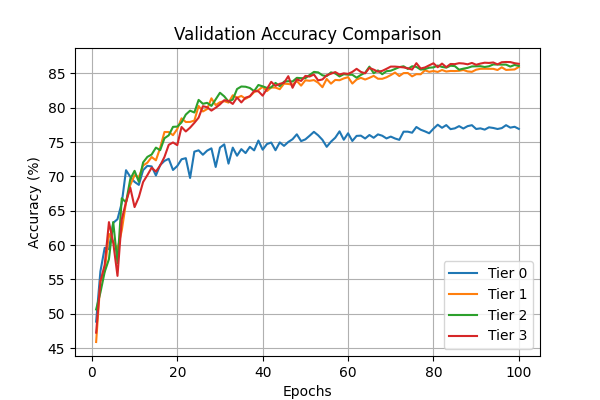
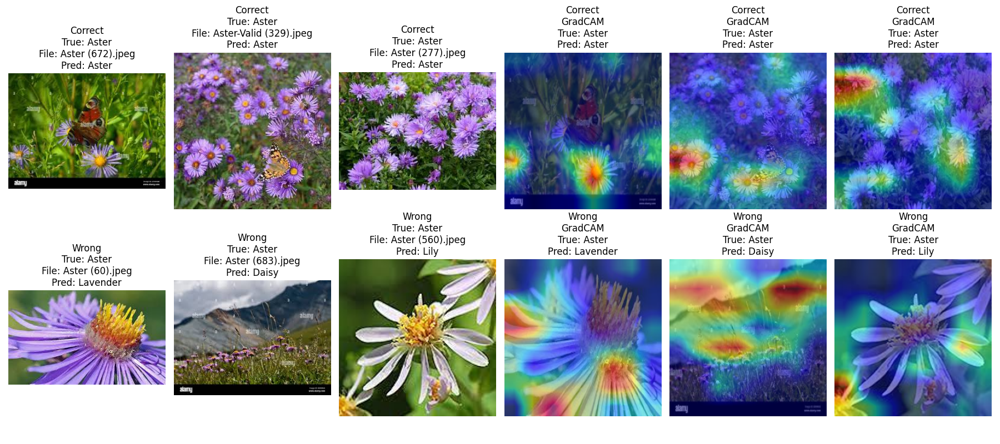
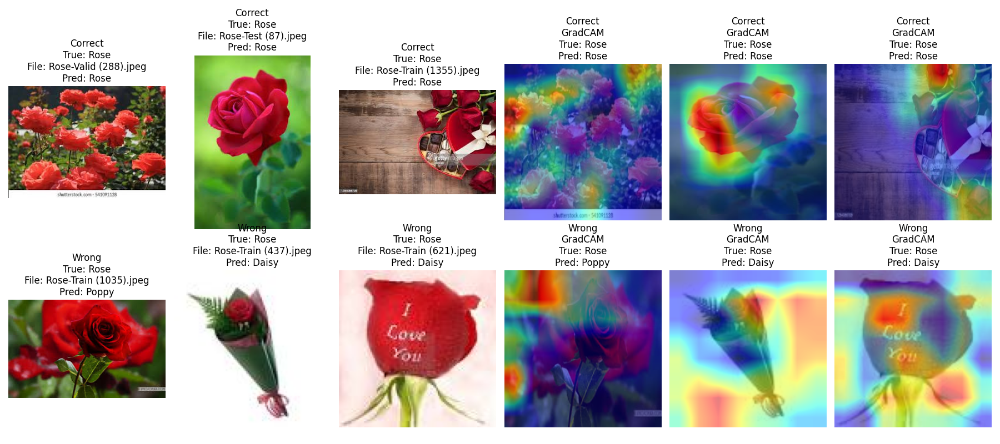

# Flower Classification (10 classes) — CNN + Augmentation

Goal: Train a baseline CNN / ResNet on a 10-class flower dataset and compare data augmentations and Grad-CAM visualizations.

  

## TL;DR
Train a CNN on a 10-class flower dataset, then compare data augmentations and visualize model focus with Grad-CAM.

---
## How to install

### Prerequisites
- Python ≥ 3.9
- PyTorch ≥ 2.0 (with CUDA if you have GPU)
- torchvision, matplotlib, etc.

### Environment Setup
git clone https://github.com/robinRossner/img-class-data-aug-comp.git

cd img-class-data-aug-comp

python -m venv venv && source venv/bin/activate

pip install -r requirements.txt

### Dataset
The flower dataset will be downloaded automatically to "./data" on the first run.

### Train model
python src.train.py --config experiments/configs/baseline.yaml

### Run Augmented Models
python src.train.py --config experiments/configs/aug_1.yaml

### Evaluate
python src/evaluate_from_config.py --config experiments/configs/baseline.yaml --split val

### Gradcam
python src/gradcam_from_config.py --config experiments/configs/baseline.yaml \
  --checkpoint experiments/checkpoints/model_epoch_best_Tier0.pth --split val --index 0 \
  --out plots/gradcam/sample0_overlay.png

## Model

The model used for training was "mobilenet_v2" with unset weights (untrained)

## Dataset
Source: Kaggle — “Flower Classification (10 classes / V2 etc.)”, organized as `root/<class_name>/*.jpg`.

**Split sizes (from `experiments/splits/*.csv`):**  
Discovered 21,710 images across 10 classes.  
Current split (train / val / test): **17,380 / 2,165 / 2,165** (≈80/10/10).

**Normalization**
- Image size: **224×224**
- Mode: imagenet
- Mean / Std: [0.485, 0.456, 0.406] / [0.229, 0.224, 0.225]

> Note: Raw images are converted to RGB if needed; non-RGB/corrupt files are skipped with a warning.

---

## Repository structure

src/             → Core training code (data, model, train, eval, utils, gradcam)

experiments/     → Configs + experiment outputs (checkpoints, logs, splits)

notebooks/       → Jupyter notebooks (sanity checks, Grad-CAM, comparisons)

plots/           → Final figures (training curves, Grad-CAM results)

requirements.txt → Dependency list

README.md        → Project overview (this file)

---

Reproducibility

Default seed: 67 (configurable).

Splits are persisted to experiments/splits/*.csv for consistent reruns.

Determinism flags enabled where practical (e.g., torch.backends.cudnn.deterministic=True).

---

## Augmentatiion Results

Below: for seed 66, 67, 68 are the averaged results graphed (accuracy vs epoch)

## Grad-CAM Visualizations

Below: For some classes, below are correctly classified ("easy") and a misclassified ("hard") sample.  

| Class |             Plot              |
|-------|:-----------------------------:|
| Daisy |  |
| Rose  |  |

### Interpretation

- **Model Focus:** Grad-CAM highlights show the model often attends to the central region of the flower, especially the petals and reproductive organs, which are key for class distinction.
- **Correct Classifications:** For easy samples, the model's attention aligns well with the main flower, ignoring background clutter.
- **Wrong Classifications:** For hard samples, the model's attention may still focus on the main flower (however sometties its hard to distinguish simliar classes) or focuses on other plants in the image.

**Common Failure Modes:**
- Background clutter or multiple flowers in frame.
- Occluded or atypical flower shapes.
- Visually similar classes (e.g., Daisy vs. Aster).

# Results

Below: Results table of 3 averaged runs and their augmentations with Validtion Acccuracy and Test Accuracy.
Both Accuracies are based on the final epoch of the model and average across the 3 seeds.

| Run      | Augmentations | Val Acc (%) |       sd +/- | Test Acc (%) |       sd +/- |
|----------|---------------|-------------|--------------|--------------|--------------|
| baseline |     None      |    76.9 %   |  +/- 0.19%   |    75.8 %    |  +/- 0.19%   |
| aug1     |  Flip + Crop  |    85.9 %   |  +/- 0.27%   |    86.3 %    |  +/- 1.51%   |
| aug2     | + ColorJitter |    86.1 %   |  +/- 0.06%   |    87.1 %    |  +/- 0.95%   |
| aug3     | + RandomErase |    86.4 %   |  +/- 0.13%   |    86.7 %    |  +/- 0.87%   |

## Conclusion
Baseline performed worst: plain training without augmentation led to the lowest validation/test accuracy and signs of relying on spurious background cues. The strongest single improvement came from simple Flip + Crop (aug1), which gave the biggest gain in val/test accuracy by forcing spatial invariance and better focus on the flower region. ColorJitter gave a small additional gain — likely because it encourages the model to rely more on shape/structure than color alone. RandomErase was mixed: it can regularize but sometimes removed whole plants/flowers from images and caused confusion. Overall, augmentations reduced overfitting (smaller train→val gap) though they sometimes slowed convergence (mild underfitting early in training).

Future work (short)
- Try vertical flips where botanically appropriate.
- Class-preserving MixCut / CutMix (mix samples only within the same class).
- Larger pretrained backbone and staged fine-tuning schedule.
- Segmentation or attention-guided cropping to remove background clutter.
- Explore semi-/unsupervised pretraining (self-supervised features or pseudo-labeling) to improve robustness.

## License & citation

License: MIT (see LICENSE).

If you use this repo, please cite or link back. Dataset credit to the Kaggle authors.